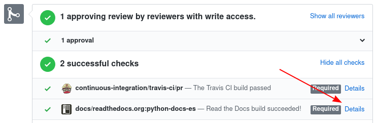

:orphan:

Guía para contribuir en la traducción
=====================================

¡Muchas gracias por tu interés en participar de la traducción de la
documentación oficial de Python al Español!

Este es el grupo de trabajo para la traducción de la
documentación oficial de Python al Español, todo el contenido de la traducción
es mantenido por voluntaries que aportan su tiempo y trabajo a la comunidad.

Antes de comenzar tu primera traducción, y que sigas con esta guia de
contribución, queremos señalar algunos
:ref:`lineamientos generales <a-tener-en-cuenta>`.

.. note::

   Si tienes cualquier duda, puedes enviarnos un email a docs-es@python.org.

   También puedes unirte a `nuestro canal de Telegram`_ si necesitas ayuda.

El proceso general de traducción son tres pasos, de los cuales el primero tendrás que
realizar solo una vez. Te los detallamos a continuación.

Paso 0: Configuración de Github
-------------------------------

Esta configuración la tienes que realizar sólo una vez, y con ello
podrás realizar todas las contribuciones que quieras.

#. Para enviar una traducción, necesitas tener un **fork** del repositorio_
   oficial, haciendo click en el botón encerrado en rojo.

   .. image:: fork.png
     :alt: botón fork

   .. note::

      Puedes consular la `ayuda oficial de GitHub`_, si lo deseas.

#. Clona el fork del repositorio que acabas de crear::

     git clone git@github.com:<TU-USUARIO>/python-docs-es.git

#. Ingresa en la carpeta que `git clone` creó en tu computadora::

     cd python-docs-es/

#. Agrega el repositorio original como "upstream"::

     git remote add upstream https://github.com/python/python-docs-es.git

#. (Opcional) Crea un entorno virtual y actívalo::

     python -m venv env
     source env/bin/activate   # macOS y Linux
     env\Scripts\activate.bat  # Windows

#. (Opcional) Instala los requerimientos del proyecto::

     pip install -r requirements.txt

   .. note::

      Al tener instalado los requerimientos, podrás utilizas las herramientas
      ``powrap`` y ``pospell`` para poder verificar tus archivos traducidos,
      y también construir la documentación localmente.

.. _que-archivo-traducir:

Paso 1: ¿Qué archivo traducir?
------------------------------

Tenemos una `lista de issues en GitHub`_ en dónde vamos coordinando el trabajo
realizado para no traducir dos veces lo mismo.  El proceso para traducir un
archivo es el siguiente:

#. Elige cualquiera de los issues que *no están asignados* a otra persona.
#. Deja un comentario en el issue diciendo que quieres trabajar en él.
#. Espera a que un administrador te asigne el issue.
#. ¡Empieza a traducir!

Paso 2: ¡Comienza a traducir!
-----------------------------

#. Tener un :ref:`archivo asignado para traducir <que-archivo-traducir>`.

#. Verifica que estás en la rama principal del repositorio, **3.12** (esto es muy
   importante para evitar crear una nueva rama a partir de una traducción
   anterior)::

     git checkout 3.12

#. Crea una rama nueva en base al artículo en el que vayas a trabajar.  Por
   ejemplo, si vas a trabajar en el archivo ``library/ast.po``, usa un nombre
   similar a::

     git checkout -b traduccion-ast

#. Una vez que hayas elegido el archivo, lo puedes abrir con el editor poedit_ y
   empezar a traducir.

#. **Formato de columnas**: Si utilizas poedit_ es posible que tu archivo tenga
   la estructura adecuada, pero te invitamos a comprobarlo con la herramienta
   powrap_, la cual puedes instalar y utilizar por la línea de comandos.
   Ejecuta::

     powrap <directorio>/tu_archivo.po

   Recuerda que tu archivo puede estar dentro de un ``<directorio>``, como
   ``library``, con lo que tendrás que ejecutar el comando ``powrap
   library/tu_archivo.po`` si no te encuentras en el mismo directorio de tu
   archivo.

   .. note:: Si estás en Windows y tienes problemas, mira los comentarios de
             :ref:`powrap_windows` para más información.

#. **Corrección ortográfica**: Para verificar la ortografía de tu archivo
   puedes utilizar la herramienta pospell_ para que verifiques que todas las
   palabras están aceptadas o incluidas en diccionarios. Para ello tenemos
   un script de conveniencia que puedes utilizar::

    python scripts/check_spell.py <directorio>/tu_archivo.po

   Si alguna palabra no es reconocida, y es una palabra válida, tienes que
   agregarla al diccionario correspondiente en el directorio dictionaries/.
   Busca el archivo que corresponde al que estás traduciendo y si no existe, créalo.
   Por ejemplo el diccionario del archivo ``library/ast.po`` se encuentra en
   ``dictionaries/library_ast.po``.

   .. note:: Si estás en Windows y tienes problemas, mira los comentarios de
             :ref:`pospell_windows` para más información.

#. Cuando hayas terminado tu sesión, debes guardar tus cambios y enviarlos a
   GitHub (No olvides añadir tu nombre al archivo ``TRANSLATORS``).
   Si estuvieras trabajando en el archivo ``library/ast.po`` los pasos serían::

     git add library/ast.po
     git commit -m 'Traducido archivo library/ast'
     git push origin traduccion-ast

   .. note::

      Mira los mensajes que el último comando imprimirá por pantalla,
      pues encontrarás un enlace para abrir un nuevo Pull-request directamente.

      Puedes consultar la `ayuda oficial de GitHub para crear un Pull Request`_
      si lo deseas.

#. En la descripción de la *Pull Request* escribe ``Closes #<número de issue>``
   (así se cierra automáticamente cuando se hace *merge*)

   .. note::

      Si hace tiempo que venis trabajando en una traducción es importante
      :ref:`mantener actualizada <mantener-actualizada>` tu copia local antes
      de realizar el *Pull Request*.

.. _a-tener-en-cuenta:

A tener en cuenta
-----------------

* Esta traducción es mantenida por **personas de todo el mundo** que hablan el
  idioma Español. No queremos atarla a ninguna región en particular y creemos
  que es un valor extra la diversidad de la misma.  Vas a encontrar secciones
  con diferentes tonalidades de países, regiones o estilos. Lo único que pedimos
  es **consistencia** dentro de un mismo módulo o sección (es decir no cambiar de
  estilo de un párrafo a otro, por ejemplo) y siempre intentar que la persona del
  otro lado pueda entender lo que estamos escribiendo (no usar lunfardo o
  regionalismos muy propios de un único lugar).

* En muchos casos el **mejor criterio** es pensar en el vocabulario que utilizamos
  cuando le explicamos a otra persona, o en el trabajo. En muchas ocasiones la
  versión en inglés o “spanglish” de la palabra es mucho mejor que decir “git
  unir” (para git merge).

* Siempre vas a tener una **revisión de lo que propongas** y en ese intercambio otras
  personas van a ayudarte a destrabar las dudas que tengas.

* Colaborar **haciendo revisiones** también es muy muy importante, así que si
  tienes un rato libre puedes comenzar por mirar los PRs pendientes de revisar.
  (mira la :doc:`Guía del revisor <reviewers-guide>`)

* La documentación es ENORME, cualquier traba que encuentres siempre puedes
  marcar el texto como **"fuzzy"** o para revisar en el futuro.
  No pierdas horas buscando la palabra perfecta.

* **No debes** traducir el contenido de ``:ref:...``, ``:term:...``, ``:dfn:...``, etc.

* Si tienes que usar palabras en inglés debes ponerlas en *cursiva* (rodeadas
  por asteriscos)

* Puedes revisar las :doc:`Preguntas Frecuentes <faq>` para leer sobre problemas conocidos.

* Si **traduces un título que es un enlace**, por favor traduce el link también (por
  ejemplo un artículo a Wikipedia). En caso de que no haya una traducción del
  artículo en Wikipedia deja el título sin traducir.

* Si tienes una **duda sobre una palabra o término**, escríbelo como mejor suene
  para vos y marca ese párrafo como "Need work" / "Necesita trabajo" en
  *poedit*. Además, escribe un comentario explicando cuál es el termino en ese
  párrafo con el que no estabas segura.

* Puedes usar `la traducción al Portugués`_ para ver cómo ellos hicieron la
  traducción de alguna palabra.

* Wikipedia puede ser útil también. Busca la palabra en Inglés, y luego mira si
  tiene una traducción al Español en la barra de la izquierda. Suelen estar
  bastante bien explicados.

* Te recomendamos abrir una **Pull Request aunque sea en formato borrador** (marcada
  como draft) desde los primeros commits de la traducción de tu fichero. De esta
  forma, puedes recibir feedback desde el principio que puedes aplicar al resto
  de la traducción, y probar el build más a menudo.

* Último pero no menos importante, **divertite y contá con la ayuda de todes**. Te
  esperamos en nuestro chat en telegram. ¡Gracias!

Previsualizar los cambios
-------------------------

Una vez que hayas hecho un *Pull Request* en GitHub, este mostrará al final de página una sección de "check".
Allí debería haber uno que diga ``docs/readthedocs.org:python-docs-es`` y al lado un link de "Details".

Haciendo click en ese link verás una versión de la documentación completa que incluirá todos tus cambios.
Tendrás que navegar hasta el archivo que hayas cambiado para ver cómo se visualiza luego del build.

Memoria de traducción
---------------------

Tenemos una :doc:`Memoria de Traducción <translation-memory>`, que usamos para tener consistencia con algunos
términos.
Si tienes alguna duda respecto a cómo traducir alguna palabra no te olvides de revisar este contenido.
Del mismo modo, si luego de trabajar sobre un término *complicado* llegas a un acuerdo con otros colaboradores:
no se olviden de agregarlo.

.. _repositorio: https://github.com/python/python-docs-es
.. _ayuda oficial de GitHub:
   https://help.github.com/es/github/getting-started-with-github/fork-a-repo
.. _ayuda oficial de GitHub para crear un Pull Request:
   https://help.github.com/es/github/collaborating-with-issues-and-pull-requests/about-pull-requests
.. _poedit: https://poedit.net/
.. _powrap: https://github.com/AFPy/powrap
.. _pospell: https://github.com/AFPy/pospell

.. _nuestro canal de Telegram: https://t.me/python_docs_es
.. _la traducción al Portugués: https://docs.python.org/pt-br/3/
.. _lista de issues en GitHub:
   https://github.com/python/python-docs-es/issues?q=is%3Aissue+is%3Aopen+sort%3Aupdated-desc+no%3Aassignee+translate
