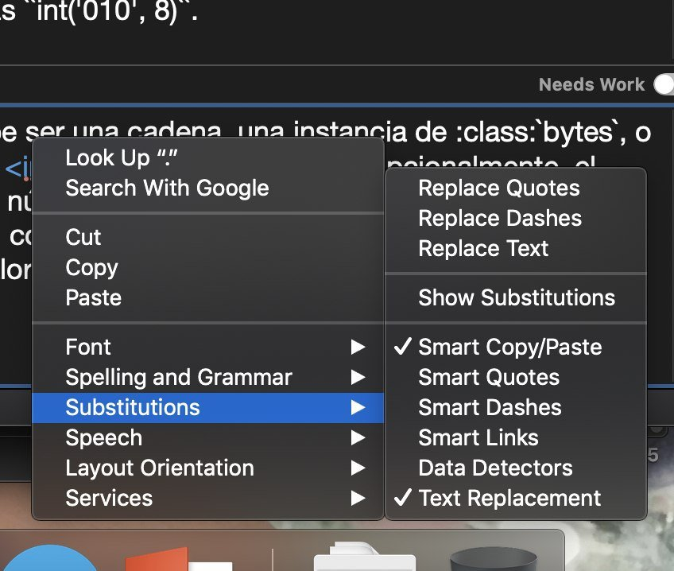

:orphan:

Preguntas frecuentes
====================

No puedo resolver un problema, ¿qué hago?
-----------------------------------------

Pregunta, |:smile:|.
Tenemos un `grupo de Telegram`_ en el que hay mucha gente que te puede ayudar.

.. _grupo de Telegram: https://t.me/python_docs_es

¿Cómo puedo instalar y configurar el chequeo con pospell?
---------------------------------------------------------

Uno de los chequeos que realiza nuestro servidor de github cada vez que hacemos
un pull de request es un test de corrección ortográfico usando la herramienta
pospell. Pospell puede ser instalada en tu entorno de Python empleando pip
(https://pypi.org/project/pospell/)::

    pip install pospell

Una vez instalado, para chequear el fichero .po sobre el que estás trabajando,
ejecuta desde el directorio principal del repo::

    python scripts/check_spell.py path/tu_fichero.po

pospell emplea la herramienta de diccionarios hunspell. Si pospell falla dando
como error que no tiene hunspell instalado, lo puedes instalar así:

.. tabs::

   .. tab:: Mac

      Utilizando ``brew`` (https://formulae.brew.sh/formula/hunspell)::

        brew install hunspell

      Este comando instala hunspell, pero puede que todavía necesites los diccionarios.
      Los diccionarios de Hunspell (``*.aff`` y ``*.dic``) en Mac deben estar en la
      carpeta ``~/Library/Spelling/`` o ``/Library/Spelling/``. Puedes encontrar
      diccionarios de español en las webs de Open Office, Mozilla y otros proyectos
      open source (ejemplo: https://cgit.freedesktop.org/libreoffice/dictionaries/tree/).

   .. tab:: Linux

      Utilizando el gestor de paquetes de tu distribución::

         # Arch Linux
         yay -S hunspell-es_es

         # Ubuntu Linux
         apt install hunspell-es

Las verificaciones del CI se realizan con ``es_ES``, pero puedes utilizar
localmente alguna otra variación.

¿Cómo agrego una palabra al diccionario?
----------------------------------------

Si ``pospell`` falla diciendo que no conoce una palabra, pero estamos seguros que esa palabra está bien escrita,
debemos agregarla al diccionario que ``pospell`` usa internamente para comprobar las palabras.

Para eso debes editar (o crear, si no existe) el archivo ``<archivopo>.txt`` dentro del direcorio ``dictionaries``
y agregar esa palabra al final de este archivo.
Nota que debes reemplazar ``<archivopo>`` por el nombre del archivo que estés traduciendo.
Por ejemplo, si estás traduciendo ``library/decimal.po``, debes editar/crear el archivos ``dictionaries/library_decimal.txt``.

¿Cómo puedo configurar git para manejar correctamente los finales de línea en Windows?
--------------------------------------------------------------------------------------

En la ayuda de git puedes encontrar información sobre este problema frecuente:
https://help.github.com/es/github/using-git/configuring-git-to-handle-line-endings

¿Cómo hago en Mac para utilizar las comillas correctas?
-------------------------------------------------------

Cuando uses ``poedit`` en Mac, es muy probable que te cambie las comillas comunes que debemos utilizar
por comillas *Smart Quotes* automáticamente. Debes desactivar este comportamiento para usar el que necesitamos.

Puedes hacerlo haciendo

#. click derecho con el mouse en el texto que estás editando
#. *Substitutions*
#. *Smart Quotes*

y repetir el proceso para *Smart Dashes*.

   Desactivar "Smart Quotes" y "Smart Dashes"

.. tip::

   Este comando te puede ayudar a cambiar todas las comillas::

     sed -i **/*.po -e 's|[“”]|\\"|g'

¿Qué parte de ``:ref:`` debo traducir?
--------------------------------------

Cuando veas el ``:ref:`` usado así,

.. code-block:: rst

   In the :ref:`article` you can find more examples.

**No debes traducir** *article*, ya que es una referencia a otro lugar de la documentación.
En la traducción al Español se mostrará el título de ese artículo en Español --no te preocupes.

Si en cambio lo ves usado así,

.. code-block:: rst

   In the section :ref:`how to redirect to a file <how-to-redirect-to-file>` from the logging HOWTO guide.

**Sí debes traducir** la parte que dice *how to redirect to a file*,
pero **no debes traducir** ``how-to-redirect-to-file``.

.. note::

   Pueder leer más sobre el rol ``:ref:`` de Sphinx en su `documentación oficial`_ para entender mejor como funcionan las referencias,
   aunque no es necesario que lo sepas para la traducción.

.. _documentación oficial: https://www.sphinx-doc.org/en/stable/usage/restructuredtext/roles.html#role-ref

¿Cómo configuro ``pre-commit``?
-------------------------------

.. warning::

   Requiere un poco de conocimiento de Python (para crear un entorno virtual) e instalar un paquete del sistema operativo.

Para utilizar ``pre-commit`` y así ejecutar unos pequeños tests antes de hacer un commit y enviar tus cambios a tu Pull Request,
debes seguir estos pasos:

#. Instalar ``pre-commit``::

     pip install pre-commit

#. Configurar ``pre-commit`` en el repositorio de ``python-docs-es``::

     cd python-docs-es/
     pre-commit install

#. Instalar ``hunspell``::

     # Arch Linux
     yay -S hunspell-es_any
     # Ubuntu Linux
     apt install hunspell-es

Luego, cada vez que realices un commit se ejecutará ``pre-commit`` y validará tus archivos.

.. note::

   Si por cualquier motivo no está funcionando ``pre-commit`` y no te deja hacer *push* de tus cambios,
   lo puedes desinstalar simplemente mediante: ``pre-commit uninstall``.

¿Cómo puedo hacer un *build* local de la documentación?
-------------------------------------------------------

.. note::

   Necesitas un poco de conocimiento para instalar ``make`` en tu sistema operativo.

Desde el mismo directorio ``python-docs-es/`` que se creó cuando hiciste ``git clone`` puedes ejecutar::

  make build

Este comando demorará unos minutos y generará toda la documentación en formato HTML en tu computadora.
Puedes ver el resultado con tu navegador de internet (Firefox, Chrome, etc) ejecutando::

  make serve

Y luego accediendo a http://localhost:8000/

.. _mantener-actualizada:

¿Cómo actualizar mi copia local del repositorio?
------------------------------------------------

Es recomendable mantener actualizada nuestra copia local para evitar
posibles conflictos entre los archivos que trabajamos y la última versión disponible
en el repositorio remoto.
Primero, necesitamos bajar los cambios de *upstream* (es el nombre que asignamos al
repositorio principal de la traducción). Se hace de la siguiente manera::

    git fetch upstream

Luego nos vamos a nuestra rama local, confirmamos e impactamos esos cambios::

    git checkout 3.12
    git merge upstream/3.12
    git push origin 3.12

¡Eso es todo!

¿Son importantes los dobles espacios en el original?
----------------------------------------------------

No.

En realidad, no tienen ningún efecto. Sphinx se da cuenta automáticamente de esto y simplemente
deja un solo espacio en la versión final. Así que, no te preocupes si ves dos espacios juntos.

Si estás interesada en saber más sobré "¿Por qué se usan dobles espacios?" puedes leer este artículo:
`How Many Spaces Should Be After a Period? <https://www.instructionalsolutions.com/blog/one-space-vs-two-after-period>`_

¿Puedo agregar "estilo de código" a los nombres de las funciones/métodos/clases/etc?
------------------------------------------------------------------------------------

No.

Si aparece el nombre de una función (por ejemplo, "IncrementalParser") en el original y no tiene ningún estilo asociado
(no está en cursiva, ni en negrita ni en estilo de código), aunque sientas la tentación de ponerla como
``IncrementalParser``, no debes hacerlo.

En principio, no debemos cambiar el formato de estas palabras. Si está con asteriscos, lo dejamos con asteriscos.
Si está con backticks, lo dejamos con los backticks, etc. Si realmente crees que es un error y debería
estar con un formato distinto, debes reportarlo en el repositorio de CPython.

¿Tienen una lista de correo?
----------------------------

Sí.

No tiene mucho tráfico aún ya que estamos usando más el canal de Telegram por el momento.
Puedes suscribirte ingresando aquí_.

.. _aquí: https://mail.python.org/mailman3/lists/docs-es.python.org/

.. _powrap_windows:

Utilizar ``powrap`` en Windows
------------------------------

Si no estás usando MinGW o el Subsistema de Linux en Windows como entorno
de trabajo, la única opción que tienes es utilizar la herramienta ``poedit``
para traducir y ajustar el largo de cada línea.

Si vas a *Preferences -> Advanced* podrás encontrar una forma de seleccionar
que los *Line endings* sean *Unix (recommended)* y que la opción **Wrap
at** esté activada y tenga el valor **70**.

La razón de estos problemas, es que ``powrap`` utiliza una dependencia
llamada ``msgcat`` que provee el paquete ``gettext`` que usualmente
se puede instalar en macOS y Linux, pero no en Windows.

.. _pospell_windows:

Utilizar ``pospell`` en Windows
-------------------------------

La herramienta ``pospell`` depende de un paquete llamado ``hunspell``, y que no
se instala por defecto mediante ``pip``.  Para instalar la dependencia tienes
dos opciones:

#. Utilizar el paquete que provee una iniciativa llamada
   *exwinports*, que puedes seleccionar desde esta
   `lista de archivos <https://sourceforge.net/projects/ezwinports/files/>`_.
   Luego descomprimes el archivo en algún lugar como ``C:\hunspell\``,
   y agregas dicho directorio al ``PATH``::

     set PATH=C:\hunspell\bin;%PATH%

   y finalmente, descarga un diccionario ``es_ES`` de algún lugar,
   por ejemplo, de `acá <https://kitscenarist.ru/downloads/hunspell/>`_.
#. Utilizar el subsistema Linux, y configurar todo desde dicho sistema,
   clonando el repositorio y todo desde ahí. Luego ejecutas la instalación
   de ``pospell`` (via pip) y ``hunspell`` (via apt-get) para utilizar
   las herramientas desde ahí.

   .. note:: Tendrás que tener todo configurado en el subsistema Linux para
             poder utilizar esta opción.

``powrap`` no muestra cambios locales, pero sí en el CI
-------------------------------------------------------

Asegúrate que tengas instalado el paquete ``gettext`` 0.21 pues es el que se
utiliza en el CI, que es una dependencia de ``powrap``.
