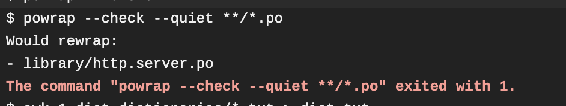
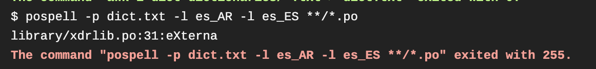
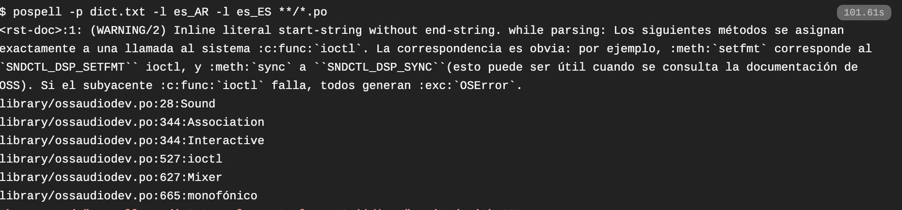
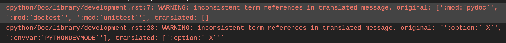

:orphan:

================================
Guía para revisar una traducción
================================

Antes que nada, queremos compartir contigo `unos videos`_ que uno de nuestros colaboradores ha preparado donde se explica el resumen del proceso a través de un ejemplo.

Asimismo, si nunca has hecho una revisión pero ya has colaborado con el proyecto, te recomendamos que pruebes esta otra manera de colaborar, ya que permite ponerse en el lugar de otra persona, y muchas veces ayuda a mejorar las traducciones propias.

.. _`unos videos`: https://www.youtube.com/watch?v=uIaQMTuwtoU&list=PLma583Z70SlztPF8SitlWJZx3SW1aAePk&index=3&t=7s&ab_channel=Cristi%C3%A1nMaureira-Fredes

El costado humano
=================
Teniendo en cuenta que todes somos voluntaries en este proyecto, es importante que la forma de comunicarnos sea clara, concisa y amable. Como revisor/a, ayudarás a voluntaries de diferentes culturas y lugares del mundo para que su traducción sea lo más acertada posible y podamos acercar Python a las comunidades de habla hispana. Recuerda que del otro lado de un PR hay una persona que ha dedicado tiempo y esfuerzo; es por eso es la forma en que le des una devolución sobre su trabajo influirá en su actitud hacia el proyecto…¡y en sus ganas de seguir participando de nuestra comunidad!
Aquí te dejamos algunos *tips* para que tu devolución sea constructiva y genuina:

* Siempre deja un comentario en la PR que deje una conclusión general de tu devolución para dejarle claro a les traductores qué necesita modificación y qué no. Recuerda siempre comenzar reconociendo los aspectos positivos del trabajo de la otra persona y luego puedes agregar comentarios/sugerencias sobre la traducción.

El costado práctico
===================
La devolución deberá ser acertada para transmitir el mensaje que necesitamos que llegue; de esta forma, les traductores podrán revisar su trabajo y saber qué necesitan hacer para mejorarlo.
No olvides que esto se trata de una traducción técnica y como tal, el objetivo es que, básicamente, la persona que la lea pueda entender cómo usar Python. Es por esto que, si bien es importante que la sintaxis sea correcta, el objetivo no es hacer una revisión intensiva del uso del español, a menos que la forma en que se expresó la idea imposibilite que otre la entienda.

Para esto, Github te ofrece opciones para afrontar una PR (ver botón *Review Changes* arriba a la derecha de los archivos modificados por les traductores):

* *Comment*: Puedes dejar un comentario sin necesariamente aprobar la PR. Asegúrate de hacerlo con claridad para que quien tradujo sepa que debe modificar algunas cosas antes de que su PR sea aprobada.
* *Approve*: Dejar esta opción solo para PRs que no necesitan modificación alguna o que solo tengan pocas faltas de ortografía o errores de tipeo, o algún error que no genere un conflicto mayor en la traducción y en su integración al repositorio.
* *Request Changes*: Utiliza esta opción cuando la traducción necesita varias modificaciones que afectan su integración al repositorio. En este caso también asegúrate de que tu mensaje sea claro y amable para acompañar al traductor en el proceso de modificar y lograr que la PR se apruebe.

*Tips*
======

* PRs de más de 1000 líneas: Te sugerimos hacer un comentario al principio del PR para indicar hasta qué línea haz hecho el review y qué hay que revisar hasta ese hito. También si tú mismo vas a continuar la review, pero no puedes hacerla de una sola vez, es útil para saber donde retomar tu trabajo.
* El uso de la opción "Needs work" en poedit genera en la línea anterior al párrafo un comentario "#, fuzzy" para que el traductor revise esa línea. Se puede usar cuando la traducción necesita revisión y en ese momento no puedes sugerir una traducción alternativa. Ten en cuenta que los párrafos con esa marca no aparecerán traducidos en el build. Como revisor, también podrías incluir ese comentario tu mismo como sugerencia.
* Al igual que cuando uno traduce, en el proceso de revisión puedes consultar y emplear las herramientas que tenemos. Por ejemplo, si no estás seguro sobre la traducción de un término sobre el que puede que ya hayamos tomado una decisión consensuada, puedes consultar la :doc:`memoria de traducción <translation-memory>` usar `scripts/find_in_po.py` o incluso comentarlo en nuestro grupo de Telegram.

El costado técnico
==================
Al revisar una traducción, deberás tener en cuenta ciertos aspectos propios de una traducción técnica de esta índole. Además de que debe entenderse el texto en español y que debes respetar el contenido de la documentación original (ver "A tener en cuenta" en la :doc:`Guía para contribuir en la traducción <CONTRIBUTING>`), contamos con herramientas en este proyecto que pueden fallar en ciertos casos, y que como revisor/a deberás tener en cuenta.

Tres razones por las que puede fallar el *build* de Travis:

``powrap`` falla
---------------------

Para facilitar la comparación de ficheros se emplea este programa que va a hacer que todas las líneas tengan el mismo tamaño. Solucionar este problema en nuestra traducción es muy sencillo, solo hay que instalar la herramienta powrap en nuestro entorno y ejecutar el comando ``powrap nuestro_fichero.po``

``sphinx-lint`` falla
---------------------

El formato en el que la documentación de python está escrito
(`reStructredText <https://es.wikipedia.org/wiki/ReStructuredText>`_ , o rst)
puede ser difícil de manejar y escribir correctamente.
``sphinx-lint`` ayuda a encontrar errores comunes al momento de escribir
entradas en este formato, y advierte al respecto.

Entre los errores más comunes están:

* Textos literales no están separados por un espacio
  respecto a las palabras que lo rodean:

  * Mal: :literal:`no hay espacio antes del\`\`literal\`\``
  * Mal: :literal:`después del \`\`literal \`\`no hay un espacio`
  * Bien: :literal:`hay espacio antes del \`\`literal\`\` y después también`

* Textos literales comienzan o terminan con espacios:

  * Mal: :literal:`\`\` literal empieza con un espacio\`\``
  * Mal: :literal:`\`\`literal termina con un espacio \`\``
  * Bien: :literal:`\`\`literal no termina ni empieza con espacios\`\``

* Textos literales no están delineados con dos acentos fuertes:

  * Mal: :literal:`\`\`falta uno al final :(\``
  * Mal: :literal:`\`falta uno al principio :(\`\``
  * Bien: :literal:`\`\`todo bien :)\`\``

* Enlaces no terminan en un guión bajo:

  * Mal: :literal:`\`<https://python.org>\``
  * Mal: :literal:`\`Python <https://python.org>\``
  * Bien: :literal:`\`<https://python.org>\`_`
  * Bien: :literal:`\`Python <https://python.org>\`_`

``pospell`` falla
---------------------

Los fallos en pospell pueden ser variados y según con que nos encontremos tenemos que actuar de una manera u otra. En principio es un chequeo de ortografía contra un diccionario de español, por lo que nos va a fallar tanto si usamos palabras en otro idioma, como si usamos palabras en español mal escritas como si usamos palabras que simplemente no están en el diccionario. Por ejemplo:

En este primer caso simplemente hay un error en la ortografía por lo que solucionarlo en nuestra traducción será lo únicoque tengamos que hacer.

En este segundo, en cambio, vemos un par de cosas más interesantes. En primer lugar, tenemos un warning de rst, donde nos da un error porque unas comillas no han sido reconocidas como final de una palabra. Si te fijas en el texto esto ocurre donde están los paréntesis pegados a la expresión entre comillas dobles SNDCTL_DSP_SYNC. Añadir un espacio allí solucionará nuestro problema. Por otro lado, nos lanza una serie de palabras que han fallado en pospell, pero como vemos, son o bien términos técnicos, o nombres en inglés (en este caso posiblemente parte de un nombre propio) y una palabra que está correctamente escrita en español pero es un poco técnica. Por tanto, en este caso no queremos cambiarlas en nuestra traducción, sino que queremos que sean una excepción en el chequeo de pospell. Para ello, lo que debemos hacer es o bien crear o bien incluir (si ya está creado) en un diccionario llamado como nuestro fichero y que se emplace en la carpeta dictionaries las palabras que deben ser una excepción. Por ejemplo, los diccionarios para el fichero clinic o argparse los encontramos dentro de ./dictionaries como howto_clinic.txt y library_argparse.txt. Cuando se haga el build se tendrán en cuenta estas excepciones y no tendremos ese error de pospell.

Sphinx falla: 
---------------------

Durante la renderización de la documentación hay toda una serie de referencias cruzadas, que deben permanecer igual en español que en inglés. Un fallo habitual es el siguiente:

Indica que alguna de las referencias falta en la traducción. Lo más probable es que al traducir se haya cambiado algo de la sintaxis particular como las comillas, y por eso no esté siendo reconocida.
